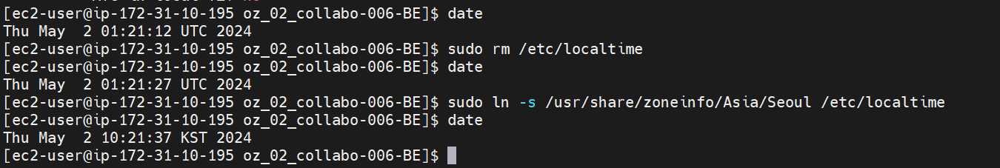

---

# 도커 삭제하기

Docker 컨테이너와 관련된 기존 데이터를 삭제하고 다시 설치하는 방법은 다음과 같습니다.

1. 실행 중인 컨테이너 중지 및 삭제하기
```
docker stop [컨테이너 ID 또는 이름]
docker rm [컨테이너 ID 또는 이름]
```

2. 사용하지 않는 이미지 삭제하기
```
docker image prune -a
```

3. 볼륨(데이터) 삭제하기
```
docker volume prune
```

4. 다시 컨테이너 실행하기
```
docker run [옵션] [이미지 이름]
```

이렇게 하면 기존에 실행 중이던 컨테이너와 데이터가 모두 삭제되고, 새로운 컨테이너가 생성됩니다.

특히 데이터베이스와 관련된 볼륨이 있다면, `docker volume prune` 명령으로 모든 볼륨을 삭제하게 됩니다. 주의해야 할 점은 이렇게 하면 기존의 모든 데이터가 영구적으로 삭제된다는 것입니다. 필요한 데이터가 있다면 백업을 해두는 것이 좋습니다.

만약 특정 컨테이너나 볼륨만 삭제하고 싶다면, 해당 ID나 이름을 지정해서 삭제할 수 있습니다.

```
docker rm [컨테이너 ID 또는 이름]
docker volume rm [볼륨 이름]
```

이렇게 하면 기존 데이터를 모두 삭제하고 완전히 새로운 환경에서 다시 시작할 수 있습니다.

---

- 도커에서 로그 확인하기  
  - sudo docker logs [컨테이너명]

    ```bash  
    sudo docker logs ps01
    ```

- 현재 실행중인 도커 컨테이너 확인  

  ```bash
  docker ps -a
  ```


---  

# amazon linux 2023  명령어  

### 타임존 변경  

- 현재시간확인  
  ```bash 
  date
  ```

- 타임존 변경
  ```bash
  sudo rm /etc/localtime
  sudo ln -s /usr/share/zoneinfo/Asia/Seoul /etc/localtime
  ```




- docker-compose 실행명령어   
  ```bash
  sudo docker-compose -f docker-compose.yml up --build -d
  ```

<br>

---  

<br>

Docker 컨테이너 내부의 파일을 보는 방법에는 여러 가지가 있습니다. 가장 일반적인 방법은 `docker exec` 명령을 사용하여 컨테이너에 접속하거나 컨테이너 내부에서 명령을 실행하는 것입니다.

### 1. 컨테이너에 Bash 쉘로 접속하기
컨테이너에 bash 쉘을 사용하여 직접 접속할 수 있습니다. 이 방법은 컨테이너 내부에서 파일을 탐색하고, 수정하며, 컨테이너의 상태를 확인할 수 있게 해줍니다. 컨테이너 내부에 bash가 설치되어 있어야 합니다.

```bash
sudo docker exec -it [컨테이너 이름 또는 ID] /bin/bash
```

예를 들어, 컨테이너 이름이 `dg01`이라면 다음과 같이 입력합니다:

```bash
sudo docker exec -it dg01 /bin/bash
```

### 2. 컨테이너 내부에서 명령 실행하기
특정 파일의 내용을 직접 보거나 디렉토리의 내용을 리스트하고 싶다면, `docker exec` 명령을 사용하여 컨테이너 내에서 명령을 실행할 수 있습니다. 예를 들어, 컨테이너 내부의 `/app` 디렉토리의 내용을 보고 싶다면 다음과 같이 입력합니다:

```bash
sudo docker exec [컨테이너 이름 또는 ID] ls /app
```

컨테이너 내의 특정 파일을 확인하고 싶다면 `cat` 명령을 사용할 수 있습니다:

```bash
sudo docker exec [컨테이너 이름 또는 ID] cat /app/example.txt
```

### 3. 컨테이너에서 파일 복사하기
컨테이너 내부의 파일을 로컬 시스템으로 복사하고 싶다면 `docker cp` 명령을 사용할 수 있습니다. 예를 들어, 컨테이너 내의 `/app/config.py` 파일을 로컬 시스템의 현재 디렉토리로 복사하고 싶다면 다음과 같이 입력합니다:

```bash
sudo docker cp [컨테이너 이름 또는 ID]:/app/config.py .
```

이 명령들을 사용하여 Docker 컨테이너 내부의 파일 시스템을 쉽게 탐색하고 필요한 정보를 얻을 수 있습니다.

<br> 

---
